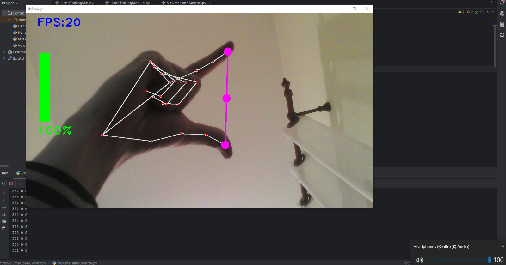

#  Volume Hand Control with Gestures

<p align="center">
  
</p>

##  About the Project:

This project allows you to control your system's **volume** and **media playback** using hand gestures. With just your hands, you can:
- Adjust the volume by moving your thumb and index finger closer or farther apart.
- Play/Pause music when all five fingers are raised.
- Skip to the next track when three middle fingers are raised.
- Go back to the previous track when only the pinky finger is raised.

Built with **Python**, this application leverages **Mediapipe** for hand tracking, **OpenCV** for real-time video processing, **PyCaw** for system volume control, and **PyAutoGUI** for media key simulation.

---


## 💻 Tech Stack:

This project uses the following technologies:

    

---

## 📊 Features:

- **Real-Time Hand Tracking:** Detects hand landmarks and tracks movements in real-time.
- **Volume Control:** Adjusts system volume based on the distance between thumb and index finger.
- **Media Playback Control:**
  - Play/Pause music with all fingers raised.
  - Skip to the next track with three middle fingers raised.
  - Go back to the previous track with only the pinky finger raised.
- **Customizable Parameters:** Easily adjust camera resolution, detection confidence, and more.

---

## ⚙️ Installation:

1. Clone the repository:

   ```bash
   git clone https://github.com/your-username/VolumeHandControl.git
   cd VolumeHandControl
   ```

2. Install the required dependencies:

   ```bash
   pip install opencv-python mediapipe pyautogui pycaw numpy
   ```

3. Ensure your webcam is connected and functioning properly.

---

## 🚀 Usage:

1. Run the main script:

   ```bash
   python VolumeHandControl.py
   ```

2. Place your hand in front of the camera to start controlling the system:
   - Move your thumb and index finger closer or farther apart to adjust the volume.
   - Raise all five fingers to play/pause the music.
   - Raise the middle three fingers (index, middle, ring) to skip to the next track.
   - Raise only the pinky finger to go back to the previous track.

3. Press `Ctrl+C` in the terminal or close the window to stop the program.

---

## 🛠 How It Works:

### Hand Detection and Tracking:
- The `HandTrakingModule.py` file contains a class `handDetector` that uses **Mediapipe** to detect and track hand landmarks in real-time.
- The `findHands` method processes the input image and draws hand landmarks if enabled.
- The `findPosition` method extracts the coordinates of each landmark and returns them as a list (`lmList`).

### Volume Control:
- The distance between the thumb and index finger is calculated using the Euclidean distance formula.
- This distance is mapped to the system's volume range using `np.interp`.
- The `pycaw` library adjusts the system volume based on the calculated value.

### Media Control:
- Specific gestures are detected using the `fingersUp` function, which checks the state of each finger (raised or not).
- Based on the detected gesture, the appropriate media key is simulated using `pyautogui.press`.

---
